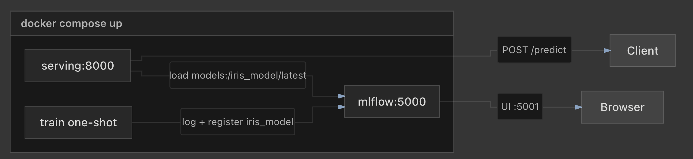

# MLflow FastAPI Demo

A machine learning workflow for training and serving Iris flower classifiers using MLflow and FastAPI.

We first start off containerization with Docker to test if `docker compose` go through all the image creation processes successfully.

Then, we orchestrate the entire flow further with Kubernetes (using minikube).

# Project Structure
- `app`: FastAPI application (serving inference requests)
  - `app.py`: FastAPI
  - `Dockerfile`: Packages FastAPI app into a container and starts it with Uvicorn
  - `requirements.txt`: Python dependencies for app.py execution
- `mlflow/Dockerfile`: MLflow server (model artifacts logging)
- `train`: Model training
  - `train.py`: Model training script
  - `Dockerfile`: Runs a training job (through train.py)
  - `requirements.txt`: Python dependencies for train.py execution
- `docker-compose.yml`: Service definitions
- `k8s/`: Kubernetes manifests (Kustomize)
- `scripts/`: Build and deploy helpers
- `mlruns/`: MLflow artifacts and runs (auto-generated)
- `mlflow.db`: SQLite backend store (auto-generated)

# Docker 

## 1. Architecture

- **MLflow Server** (port 5001): Tracks experiments, logs models, and stores artifacts
  - Note: port 5001 is chosen because port 5000 is in use.
- **Training Script**: Trains a Random Forest classifier on the Iris dataset and registers it
- **FastAPI Serving** (port 8000): Loads the latest model and exposes a prediction endpoint





## 2. Setup

### Prerequisites

- Docker and Docker Compose

### Start the Stack

```bash
docker compose up -d
```

This starts MLflow and the FastAPI server. MLflow is available at `http://localhost:5001` and the API at `http://localhost:8000`.

### Train a Model (optionally)

```bash
docker compose run --rm train
```

This trains a new Random Forest model on the Iris dataset and registers it as `iris_model` in MLflow.

## 3. Make a Prediction

```bash
curl -X POST http://localhost:8000/predict \
  -H "Content-Type: application/json" \
  -d '{
    "sepal_length": 5.1,
    "sepal_width": 3.5,
    "petal_length": 1.4,
    "petal_width": 0.2
  }'
```

Response:

```json
{"prediction": 0}
```

## 4. Check Health

```bash
curl http://localhost:8000/health
```

Response:

```json
{"status": "ok", "model_loaded": true}
```

## 5. Stop the Stack

```bash
docker compose down
```

## 6. Create Multiple Stacks (optionally)

To run multiple instances with different names:

```bash
docker compose -p my-project-name up -d
```

Stop it with:

```bash
docker compose -p my-project-name down
```

## Deploy to Kubernetes

### Prerequisites

- Docker
- kubectl
- A Kubernetes cluster (minikube, kind, or cloud)
- Optional: [Kustomize](https://kubectl.docs.kubernetes.io/installation/kustomize/) (built into kubectl 1.14+)

### Quick Start (minikube / local cluster)

```bash
# Build images and deploy with NodePort services
./scripts/deploy-k8s.sh
```

This script:

1. Builds three container images (`mlflow`, `train`, `serving`)
2. Loads them into minikube if minikube is running
3. Applies manifests from `k8s/overlays/local`
4. Waits for MLflow, the training Job, and the serving Deployment

### Manual Deploy

```bash
# 1. Build images
./scripts/build-images.sh

# 2. Load into cluster (example: minikube)
minikube image load mlflow-fastapi-mlflow:latest
minikube image load mlflow-fastapi-train:latest
minikube image load mlflow-fastapi-serving:latest

# 3. Apply manifests
kubectl apply -k k8s/overlays/local
# or
kubectl apply -k k8s/base             
```

### Make a Prediction (Kubernetes)

```bash
# If running minikube on top of Docker Desktop, this is the way to expose the service
expose minikube service serving-svc -n mlflow-fastapi
```

```bash
# Request a prediction
curl -X POST "http://serving.myiris.com/predict" \
  -H "Content-Type: application/json" \
  -d '{
    "sepal_length": 5.1,
    "sepal_width": 3.5,
    "petal_length": 1.4,
    "petal_width": 0.2
  }'
```

### Retrain the Model

Jobs are immutable. Delete the existing Job before retraining:

```bash
kubectl -n mlflow-fastapi delete job train
kubectl apply -f k8s/base/train-job.yaml
kubectl -n mlflow-fastapi rollout restart deployment/serving
```

### Push to a Container Registry

```bash
REGISTRY=ghcr.io/your-org/ ./scripts/build-images.sh
```

Then update image names in `k8s/base/kustomization.yaml` to match your registry.

### Kubernetes Notes

- PVCs use `ReadWriteOnce`. On multi-node clusters, MLflow, train, and serving must schedule on the same node, or use shared storage (NFS, EFS, etc.).
- SQLite backend is suitable for demos only. Production should use PostgreSQL and S3/GCS for artifacts.
- The serving Deployment waits for the `iris_model` registered model before starting.

## Improvements

- SQLite + shared volume: `sqlite:///mlflow.db` with a bind-mounted `./mlflow.db` is fine for a local demo. It does not scale to multiple MLflow replicas or heavy concurrent writes. Production should use PostgreSQL (or similar) and S3/GCS for artifacts.
- No `tests/`. Even a small pytest suite (health endpoint, predict with mocked model, train smoke test) would catch regressions in the Compose flow.

