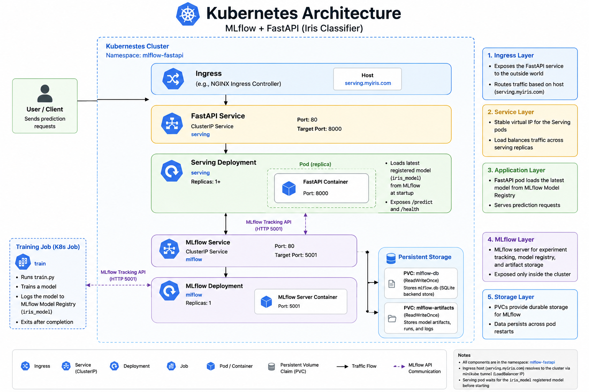
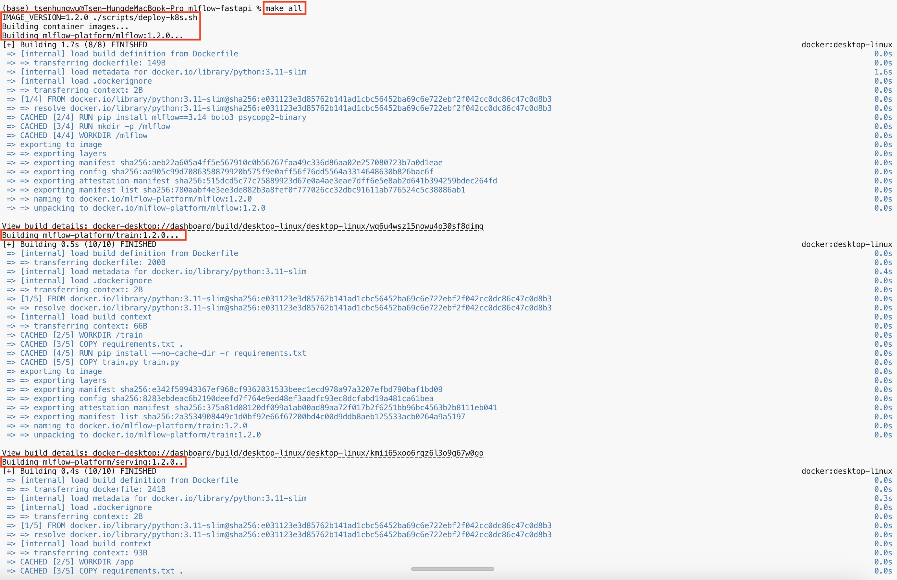
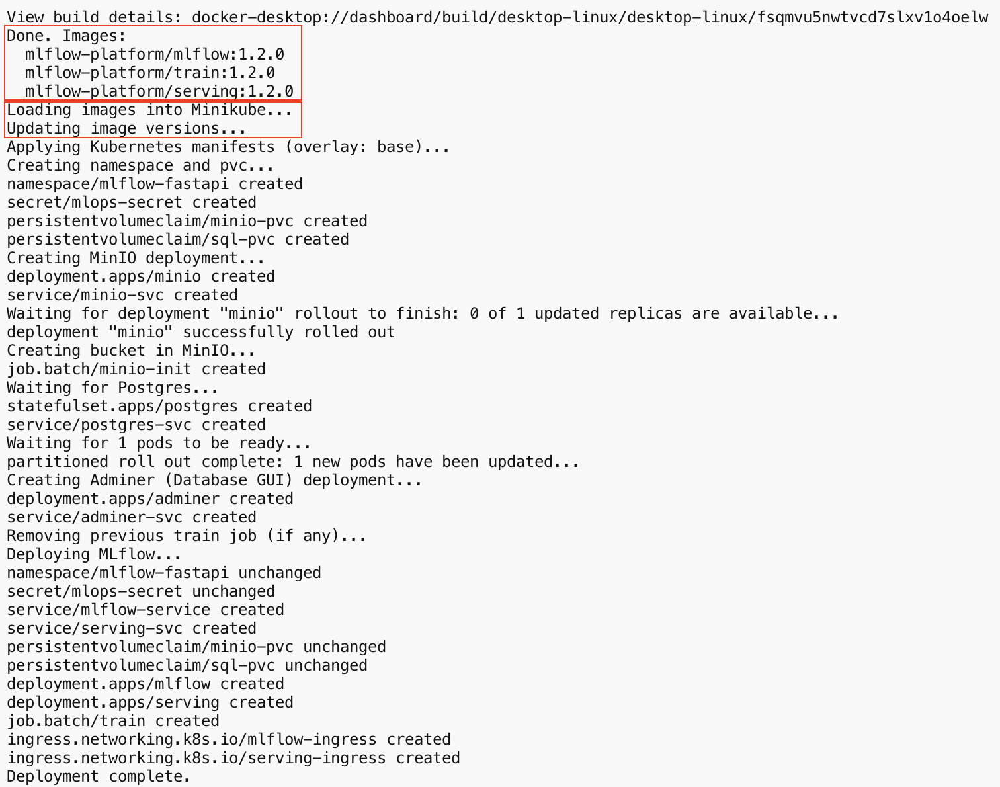
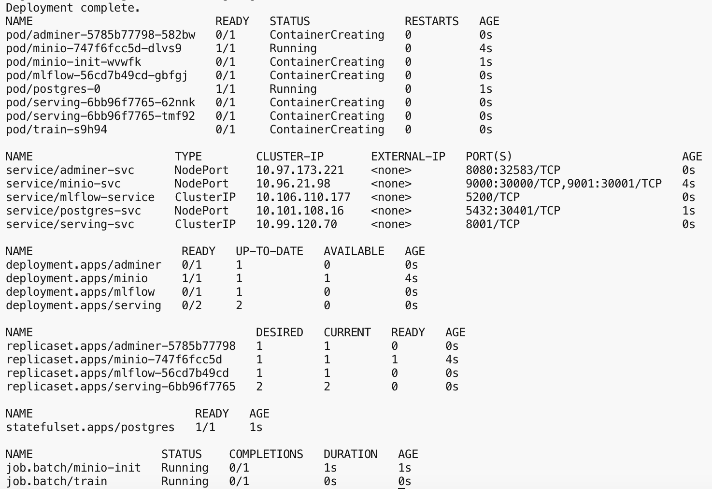
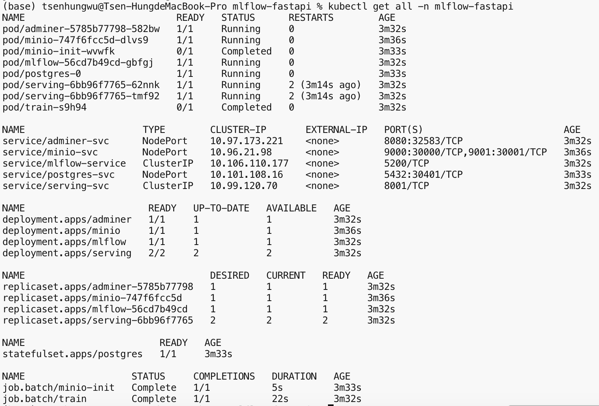

# Overview

A containerized end-to-end MLOps pipeline demonstrating model training, experiment tracking, model registry, and online inference serving using MLflow, FastAPI, Docker Compose, and Kubernetes.

The project first validates the complete ML workflow locally using Docker Compose, including image building, MLflow tracking, model training, and inference serving.

After the validation, the entire ML workflow is orchestrated with Kubernetes.

# Project Structure

- `app`: FastAPI application (serving inference requests)
  - `app.py`: FastAPI
  - `Dockerfile`: Packages FastAPI app into a container and starts it with Uvicorn
  - `requirements.txt`: Python dependencies for app.py execution
- `mlflow/Dockerfile`: MLflow server (model artifacts logging)
- `train`: Model training
  - `train.py`: Model training script
  - `Dockerfile`: Runs a training job (through train.py)
  - `requirements.txt`: Python dependencies for train.py execution
- `docker-compose.yml`: Service definitions
- `k8s/`: Kubernetes manifests (Kustomize)
- `scripts/`: Build and deploy helpers
- `mlruns/`: MLflow artifacts and runs (auto-generated)
- `mlflow.db`: SQLite MLflow backend store (generated at runtime)

# Docker

## 1. Architecture

- Training container trains a Random Forest model.
- The trained model is logged to MLflow Model Registry.
- FastAPI loads the latest registered model version.
- Prediction requests are served through the REST API.


## 2. Setup

### Prerequisites

- Docker and Docker Compose

### Start the Stack

```bash
docker compose up -d
```

This starts MLflow and the FastAPI server. MLflow is available at `http://localhost:5001` and the API at `http://localhost:8000`.

```bash
# Check status
docker compose ps
```

```
NAME                  STATUS
mlflow                running
serving               running
```

### Train a Model (optionally)

```bash
# The training container is executed as a one-off job because training is an offline workflow, 
# unlike the long-running MLflow and FastAPI services.
docker compose run --rm train
```

This trains a new Random Forest model on the Iris dataset and registers it as `iris_model` in MLflow.

## 3. Make a Prediction

```bash
curl -X POST http://localhost:8000/predict \
  -H "Content-Type: application/json" \
  -d '{
    "sepal_length": 5.1,
    "sepal_width": 3.5,
    "petal_length": 1.4,
    "petal_width": 0.2
  }'
```

Response:

```json
{"prediction": 0}
```

## 4. Check Health

```bash
curl http://localhost:8000/health
```

Response:

```json
{"status": "ok", "model_loaded": true}
```

## 5. Stop the Stack

```bash
docker compose down
```

## 6. Create Multiple Stacks (optionally)

To run multiple instances with different names:

```bash
docker compose -p my-project-name up -d
```

Stop it with:

```bash
docker compose -p my-project-name down
```

# Deploy to Kubernetes

## 1. Prerequisites

- Docker
- kubectl
- A Kubernetes cluster (minikube, kind, or cloud)
- Optional: [Kustomize](https://kubectl.docs.kubernetes.io/installation/kustomize/) (built into kubectl 1.14+)

## 2. Architecture



## 3. Automatic Deployment (minikube / local cluster)

```bash
make all
```
Upon triggering deployment through `make all`, we can track the progress through what `scripts/deploy-k8s.sh` provides.

### Step 1 - Image Preparation

- Tags all images (in this case: `mlflow`, `train`, `serving` to v1.2.0)
- Builds all container images (`mlflow`, `train`, `serving`)

### Step 2 - Image Loading

- Loads images into Kubernetes (e.g., Minikube)
- Updates images tags to ensure Kubernetes references the same before deployment

### Step 3 - Deployment

- Creates deployments, jobs, etc, in sequence:
  - Namespace
  - PersistentVolumeClaims (one for MinIO and one for PostgreSQL)
  - Secrets (credentials for MinIO and PostgreSQL)
  - MinIO Deployment (MLflow artifact store) and its NodePort Service (`minio-svc`)
    - Wait until the MinIO Deployment is ready (up to 120 seconds)
  - MinIO initialization Job
    - Creates an `mlflow` bucket in MinIO
  - PostgreSQL StatefulSet (MLflow backend store) and its NodePort Service (`postgres-svc`)
    - Wait until the PostgreSQL StatefulSet rollout completes (up to 120 seconds)
  - Adminer Deployment and its NodePort Service (`adminer-svc`)
    - Provides a web GUI for browsing the PostgreSQL database
  - Remove any existing training Job from a previous run
  - MLflow Deployment, ClusterIP Service, and Ingress
  - Training Job
  - Serving Deployment (serves the trained model for real-time inference)

### Step 4 - Deployment Completion & Inspection


## 4. Make a Prediction

```bash
# Required when using minikube with the Docker driver
minikube tunnel
```

`minikube tunnel` does the following jobs:

- Creates network routes from the host into the minikube network.
- Maintains those routes while the process is running.
- Makes Kubernetes services and ingress endpoints reachable from the host.

```bash
# Request a prediction
curl -X POST "http://serving.myiris.com/predict" \
  -H "Content-Type: application/json" \
  -d '{
    "sepal_length": 5.1,
    "sepal_width": 3.5,
    "petal_length": 1.4,
    "petal_width": 0.2
  }'
```

### Retrain the Model (optionally)

Jobs are immutable. Delete the existing Job before retraining:

```bash
kubectl -n mlflow-fastapi delete job train
kubectl apply -f k8s/base/train-job.yaml

# The serving pod must restart because the model is loaded during application startup.
kubectl -n mlflow-fastapi rollout restart deployment/serving
```

### Push to a Container Registry (optionally)

```bash
REGISTRY=ghcr.io/your-org/ ./scripts/build-images.sh
```

Then update image names in `k8s/base/kustomization.yaml` to match your registry.

## Current Limitations

- No automated testing
- No CI/CD pipeline

## Future Improvements

- GitHub Actions CI/CD
